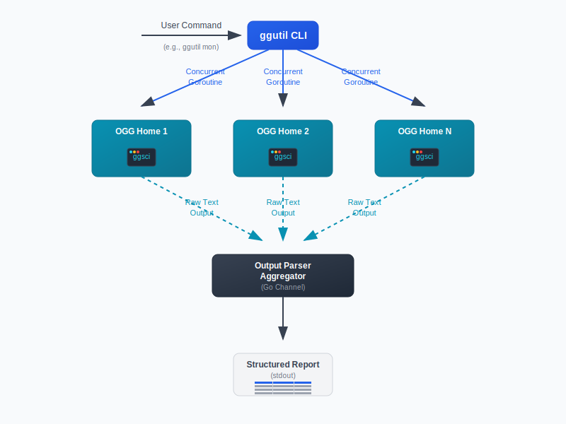

[简体中文](./README-zh.md) | [日本語](./README-ja.md)

# ggutil

**ggutil** is a command-line management tool designed for enterprise-level Oracle GoldenGate (OGG) multi-instance environments. It supports concurrent batch operations across multiple OGG Homes, significantly enhancing the automation and efficiency of daily OGG operations, monitoring, configuration, and data collection. This tool is fully open-source; contributions and discussions are welcome!

Developed from years of practical experience, `ggutil` addresses the complexity of managing numerous OGG software instances on a single server or cluster. It leverages the remote operation capabilities available in GoldenGate 12c and later versions, which support most databases, to provide a powerful and centralized maintenance toolkit. With years of production experience, the tool has proven its stability and supports GoldenGate for Oracle, MySQL, DB2 LUW, DB2 z/OS, and Big Data.

- Open Source Repository: [https://github.com/goodwaysIT/ggutil](https://github.com/goodwaysIT/ggutil)

---

## Key Features

- **Concurrent Management of Multiple OGG Homes**: Supports configuration of multiple OGG Home paths, with all commands processed concurrently to greatly improve efficiency.
- **Rich Subcommand System**:
  - `tasks`: Batch query `SOURCEISTABLE` tasks across all OGG Homes, grouped display, with friendly prompts for no tasks.
  - `mon`: Batch retrieve version, path, and `info all` runtime status for all OGG Homes.
  - `info <process_name>`: Query detailed information for a specified process (Extract/Replicat) across all OGG Homes.
  - `param <process_name>`: Batch read the parameter file content for a specified process.
  - `config`: Batch display parameters and configuration tables for major processes in all OGG Homes.
  - `backup`: One-click backup of key configurations, logs, report files, etc., for all OGG Homes, archived to a timestamped directory and automatically cleaned up.
  - `stats <process_name>`: Collect and display business table operation counts for a specified process by total, daily, and hourly dimensions.
  - `collect <process_name>`: Batch collect all relevant files (info/detail/showch/status, etc.) for a specified process, automatically archived.
- **Elegant Output**: All table outputs use `gotabulate` for clear structure, suitable for direct use in operational reports.
- **Concurrency and Performance**: All batch operations are executed concurrently, fully utilizing multi-core resources.
- **Robust Parameter Validation & Error Prompts**: Detailed validation and prompts for all parameters, environment variables, and paths, with debug mode for detailed log output.
- **Highly Extensible & Developer-Friendly**: Core logic is highly modular, facilitating integration into larger operations platforms or custom development.
- **Detailed English Comments & Professional Code Style**: Facilitates team collaboration, code review, and internationalization.

---

## Architecture Overview

Below is the concurrent workflow architecture of ggutil CLI:



---

## Installation and Requirements

- **Operating System**: Linux (Oracle Linux/RedHat/CentOS recommended)
- **Dependencies**:
  - Go 1.18 or higher
  - Oracle GoldenGate installed and configured (multi-Home support)
  - Third-party Go libraries: `urfave/cli/v2`, `bndr/gotabulate`, `mholt/archiver/v3`
- **Installation Methods**:

  **Method 1: Direct Download (Recommended)**

  No compilation or Go environment needed. Directly go to the [Releases Page](https://github.com/goodwaysIT/ggutil/releases) to download the binary package for your platform (e.g., `ggutil-x86_64`, `ggutil-arm64`), then grant executable permissions:
  ```bash
  wget https://github.com/goodwaysIT/ggutil/releases/download/v1.0.0/ggutil-x86_64
  chmod +x ggutil-x86_64
  ./ggutil-x86_64 -h
  ```
  > For ARM architecture, download `ggutil-arm64`. Choose the corresponding version for other platforms.

  **Method 2: Compile from Source**

  Requires a local Go environment. Suitable for customization or secondary development scenarios.
  ```bash
  git clone https://github.com/goodwaysIT/ggutil.git
  cd ggutil
  go build -o ggutil main.go
  # Or run directly: go run main.go <command>
  ```

---

> For detailed build instructions, see [BUILD.md](./BUILD.md)

## Quick Start

### 1. Configure OGG Home Paths

- Recommended: Specify multiple OGG Homes (separated by commas or semicolons) via the `GG_HOMES` environment variable or the `-g/--gghomes` parameter:
  ```bash
  export GG_HOMES="/ogg1,/ogg2,/ogg3"
  ./ggutil tasks
  # Or
  ./ggutil -g "/ogg1,/ogg2" info extorcl
  ```

### 2. View All Commands and Help

```bash
./ggutil -h
./ggutil <subcommand> -h
```

### 3. Common Command Examples

- **Show Help Information**

  ```bash
  $ ggutil -h
  NAME:
     ggutil - Oracle GoldenGate multi-instance management tool
              Open Source: https://github.com/goodwaysIT/ggutil

  USAGE:
     ggutil [global options] command [command options]

  COMMANDS:
     version  Show application version and open source repository
     tasks    List all OGG SOURCEISTABLE tasks under all homes.
     mon      Get version and path information for all OGG instances, print 'info all' results for each.
     info     Get information for OGG processes (iterates over all configured OGG Homes).
     param    Get parameter configuration for OGG processes (iterates over all configured OGG Homes).
     config   View process configuration details within OGG instances (iterates over all configured OGG Homes).
     backup   Backup configuration, log, report files, etc., for OGG instances (iterates over all configured OGG Homes).
     stats    View statistics for a specific OGG process (total, daily, hourly) (iterates over all configured OGG Homes).
     collect  Collect information for a specific OGG process (info, infodetail, showch, status) (iterates over all configured OGG Homes).
     help, h  Shows a list of commands or help for one command

  GLOBAL OPTIONS:
     --gghomes value, -g value  Specify one or more OGG Home paths, comma-separated. If not specified, attempts to read from GG_HOMES environment variable. [$GG_HOMES]
     --debug                    Enable debug output (show errors, warnings, exceptions) (default: false)
     --help, -h                 show help
  ```

- **Monitor All OGG Instances (`mon`)**

  ```bash
  $ ggutil mon

  ==== Home: /acfsogg/oggb, OGG for Big Data, Version 19.1.0.0.200714 OGGCORE_19.1.0.0.0OGGBP_PLATFORMS_200628.2141

  Program     Status      Group       Lag at Chkpt  Time Since Chkpt

  MANAGER     RUNNING
  REPLICAT    RUNNING     RKAFKA      00:00:00      00:00:05


  --------------------------------------------------------------------------------


  ==== Home: /acfsogg/oggm, OGG for MySQL, Version 19.1.0.0.230418 OGGCORE_19.1.0.0.0OGGBP_PLATFORMS_230413.1325

  Program     Status      Group       Lag at Chkpt  Time Since Chkpt

  MANAGER     RUNNING
  REPLICAT    RUNNING     REPMYSQL    00:00:00      00:00:05


  --------------------------------------------------------------------------------


  ==== Home: /acfsogg/oggp, OGG for PostgreSQL, Version 21.14.0.0.0 OGGCORE_21.14.0.0.0OGGRU_PLATFORMS_240404.1108

  Program     Status      Group       Lag at Chkpt  Time Since Chkpt

  MANAGER     RUNNING
  EXTRACT     RUNNING     EXT_PG      00:00:00      00:00:07
  REPLICAT    RUNNING     REP_PG      00:00:00      00:00:01


  --------------------------------------------------------------------------------


  ==== Home: /acfsogg/oggo, OGG for Oracle, Version 19.1.0.0.4 OGGCORE_19.1.0.0.0_PLATFORMS_191017.1054_FBO

  Program     Status      Group       Lag at Chkpt  Time Since Chkpt

  MANAGER     RUNNING
  EXTRACT     RUNNING     DPORA       00:00:00      00:00:06
  EXTRACT     RUNNING     EXTORA      00:00:00      00:00:03


  --------------------------------------------------------------------------------
  ```

- **View Process Configurations (`config`)**

  ```bash
  $ ggutil config

  ==== Home: /acfsogg/oggm, OGG for MySQL, Version 19.1.0.0.230418 OGGCORE_19.1.0.0.0OGGBP_PLATFORMS_230413.1325

  Program    Status     Group      TabNo(prm) TabNo(rpt) Source                                       Target
  ---------- ---------- ---------- ---------- ---------- -------------------------------------------- --------------------------------------------
  REPLICAT   RUNNING    REPMYSQL   1          1          ./dirdat/my000000000(4539575)                ogg_target_db@mysqldb:3306


  ==== Home: /acfsogg/oggb, OGG for Big Data, Version 19.1.0.0.200714 OGGCORE_19.1.0.0.0OGGBP_PLATFORMS_200628.2141

  Program    Status     Group      TabNo(prm) TabNo(rpt) Source                                       Target
  ---------- ---------- ---------- ---------- ---------- -------------------------------------------- --------------------------------------------
  REPLICAT   RUNNING    RKAFKA     1          1          AdapterExamples/trail/tr000000000(5660)      Kafka


  ==== Home: /acfsogg/oggp, OGG for PostgreSQL, Version 21.14.0.0.0 OGGCORE_21.14.0.0.0OGGRU_PLATFORMS_240404.1108

  Program    Status     Group      TabNo(prm) TabNo(rpt) Source                                       Target
  ---------- ---------- ---------- ---------- ---------- -------------------------------------------- --------------------------------------------
  EXTRACT    RUNNING    EXT_PG     1          1          testpdb,                                     ./dirdat/pg000000001(1719914)
  REPLICAT   RUNNING    REP_PG     1          1          ./dirdat/pg000000001(1719914)                testpdb


  ==== Home: /acfsogg/oggo, OGG for Oracle, Version 19.1.0.0.4 OGGCORE_19.1.0.0.0_PLATFORMS_191017.1054_FBO

  Program    Status     Group      TabNo(prm) TabNo(rpt) Source                                       Target
  ---------- ---------- ---------- ---------- ---------- -------------------------------------------- --------------------------------------------
  EXTRACT*p  RUNNING    DPORA      1          1          /acfsogg/oggo/dirdat/or000000001(2700)       mysqldb,
  EXTRACT    RUNNING    EXTORA     1          1          oracledb/orcl,                               ./dirdat/or000000001(2700)
  ```

- **View Parameter File (`param`)**

  ```bash
  $ ggutil param extora

  ==== OGG Process [ EXTORA ] Under Home: [ /acfsogg/oggo ] ====

  Param file [ /acfsogg/oggo/dirprm/extora.prm ] content for 'EXTORA':

  EXTRACT extora
  USERID c##ogguser@oracledb/orcl, PASSWORD ogguser2025
  FETCHOPTIONS FETCHPKUPDATECOLS
  discardfile ./dirrpt/extora.dsc, append, megabytes 1000
  exttrail ./dirdat/or
  sourcecatalog orclpdb
  DDL INCLUDE MAPPED
  TABLE TUSER.TTAB1;
  ```

- **View Process Statistics (`stats`)**

  ```bash
  $ ggutil stats rep_pg

  ==== OGG Process [ REP_PG ] Under Home: [ /acfsogg/oggp ] ====

  ========================================[total stats]========================================

  *** Total statistics since 2025-07-05 14:53:19 ***
  +-------------------------------+------------+------------+------------+------------+------------+-------------+---------------+
  | Table Name                    | Insert     | Updates    | Befores    | Deletes    | Upserts    | Discards    | Operations    |
  +===============================+============+============+============+============+============+=============+===============+
  | source_schema.source_table    | 5000.00    | 4000.00    |            | 3000.00    | 0.00       | 0.00        | 12000.00      |
  +-------------------------------+------------+------------+------------+------------+------------+-------------+---------------+

  ========================================[daily stats]========================================

  *** Daily statistics since 2025-07-05 14:53:19 ***
  +-------------------------------+------------+------------+------------+------------+------------+-------------+---------------+
  | Table Name                    | Insert     | Updates    | Befores    | Deletes    | Upserts    | Discards    | Operations    |
  +===============================+============+============+============+============+============+=============+===============+
  | source_schema.source_table    | 5000.00    | 4000.00    |            | 3000.00    | 0.00       | 0.00        | 12000.00      |
  +-------------------------------+------------+------------+------------+------------+------------+-------------+---------------+

  ========================================[hourly stats/sec]========================================

  *** Hourly statistics since 2025-07-05 14:53:19 ***
  +-------------------------------+-----------+------------+------------+------------+------------+-------------+---------------+
  | Table Name                    | Insert    | Updates    | Befores    | Deletes    | Upserts    | Discards    | Operations    |
  +===============================+===========+============+============+============+============+=============+===============+
  | source_schema.source_table    | 0.01      | 0.01       |            | 0.01       | 0.00       | 0.00        | 0.02          |
  +-------------------------------+-----------+------------+------------+------------+------------+-------------+---------------+
  ```

- **Backup Key Files (`backup`)**

  ```bash
  $ ggutil backup

  Please refer to gz file /tmp/oggbackup_xugu01_20250711_195536.tar.gz
  ```

---

## Design Philosophy and Architecture

- **Concurrency First**: All OGG Home operations use goroutines for concurrency, greatly improving batch processing performance.
- **User-Friendly Output**: All command outputs are structured tables, easy for manual reading and automated collection.
- **Code Maintainability**: All core modules and utility functions have detailed English comments, facilitating team collaboration and secondary development.
- **Robustness**: Detailed validation and error prompts for parameters, environment variables, paths, etc. Debug mode allows tracking detailed logs.
- **Safety**: All archiving, deletion, and file operations include exception handling to prevent accidental deletion or overwriting.

---

## Use Cases

- Daily batch operations and monitoring for multi-OGG Home environments.
- Automated archiving and backup of OGG configuration, log, and report files.
- Batch collection and report output of OGG process status, parameters, and statistical information.
- Suitable for DBAs, data synchronization platforms, and automated operations teams.

---

## Contribution and Support

- Issues, PRs, suggestions, and discussions are welcome.
- For enterprise-level custom development and technical support, please contact the author or leave a message via GitHub issues.

---

## Open Source License

This project is licensed under the MIT License. See [LICENSE](LICENSE) for details.

---

For feature extensions or enterprise customization, please contact the maintainers or submit an issue!
